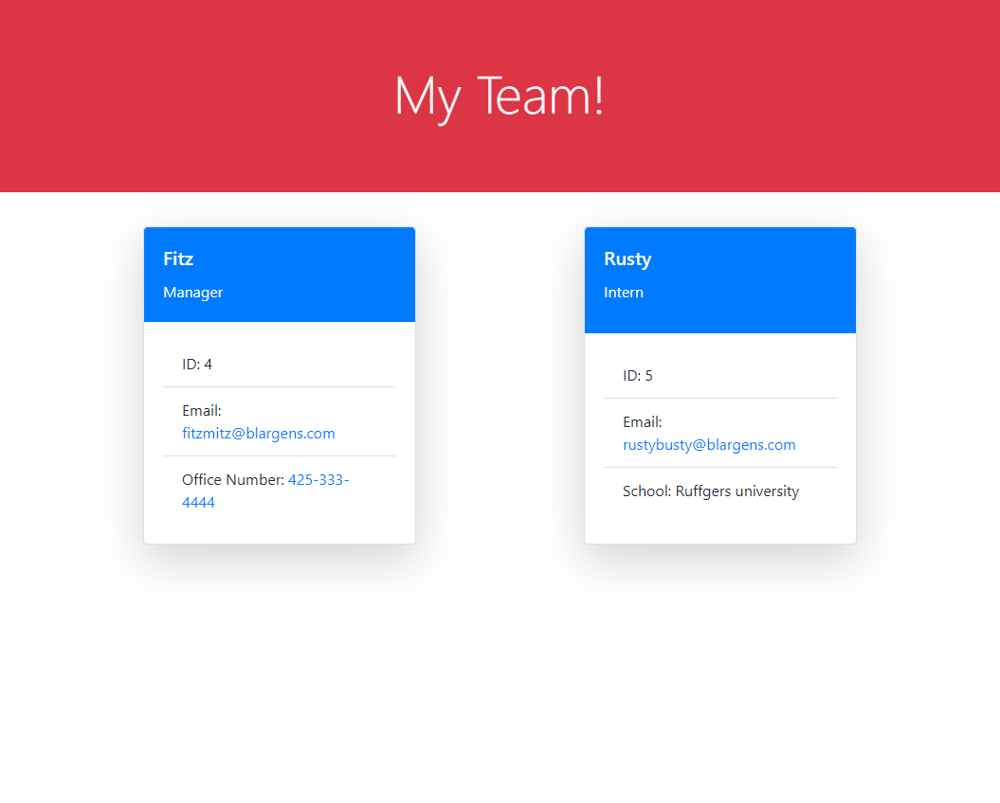

# 10 - OOP - Team-Profile-Generator

[](https://opensource.org/licenses/MIT)

## Contributors

[Chris Kimball](https://github.com/chirskimball "chirskimball's GitHub Profile")


## Description

The following project is a Team Profile generator. When the application is ran the user will be prompted a series of questions to build out their team. Once all team members have been added, a HTML webpage will be generated with cards for each employee on the team.

Each employee that is generated through the question prompts will have their information stored in an employee object constructed by the `Employee` class and `Manager`, `Employee`, and `Intern` subclasses. Every respective employee object will be stored in an Employee's array which will contain all employee objects generated through user input.

When the application is run, the user will initially be prompted in the command line with the following questions to add details about the manager of the team:

* What is the team manager's name?
* What is the team manager's id?
* What is the team manager's email?
* What is the team manager's office number?

After this line of questioning the user will be prompted with options for their next action:

* Add an Engineer to my team.
* Add an Intern to my team.
* Finish Building my team.

If `Add an Engineer to my team.` is selected, the user will be prompted to add details about the Engineer and then will be prompted again about what their next action should be.

* What is the engineer's name?
* What is the engineer's id?
* What is the engineer's email?
* What is the engineer's GitHub username?

If `Add an Intern to my team.` is selected, the user will be prompted to add details about the Intern and then will be prompted again about what their next action should be.

* What is the intern's name?
* What is the intern's id?
* What is the intern's email?
* What is the intern's School?

If `Finish Building my team.` is selected, the application will break out of its repeated lines of questioning and generate an `index.html` HTML page in the `dist` folder within this repository. Each employee that the user has created will have their information printed to a card on this `index.html` page.


## Table of Contents 

* [Web Addresses](#web-addresses)
* [Installation](#installation)
* [Usage](#usage)
* [Tests](#tests)
* [License](#license)
* [Techology Used](#technology-used)
* [Questions](#questions)
* [Screenshots](#screenshots)


## Web Addresses
---------------

*  [Github Repository](https://github.com/chriskimball/Team-Profile-Generator "Github Repo")
*  [Readme Generator Demo](https://watch.screencastify.com/v/UibbqyCSSbbeiCwxrOKp "Video walkthrough")


## Installation

1. Clone this Git repository
2. Navigate to repository in local directory.
3. To install any necessary dependencies, run the following command:

```bash
npm i
``` 


## Usage

You will need node.js to run this application. Once the repository has been cloned navigate to the file directory and run the following command.

```bash
node index.js
```

## Tests

To run tests run the following command:

```bash
npm run test
```

## License

This project is licensed under the MIT license.


## Technology Used

* Javascript
* Node.js
* Node.js Inquirer package
* Node.js FS Module
* Node.js Jest module


## Questions

If you have any questions about the repo, open an issue or contact me directly at [ctrain21@gmail.com](mailto:ctrain21@gmail.com). You can find more of my work at [chirskimball](https://github.com/chirskimball "chirskimball's GitHub Profile").

## Screenshots

### Screenshot of inquirer prompts in Terminal


### Screenshot of the generated HTML page

